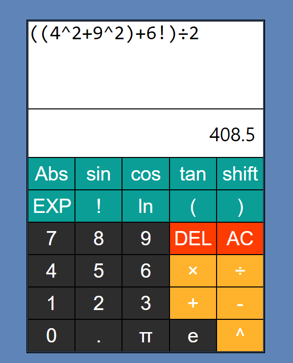
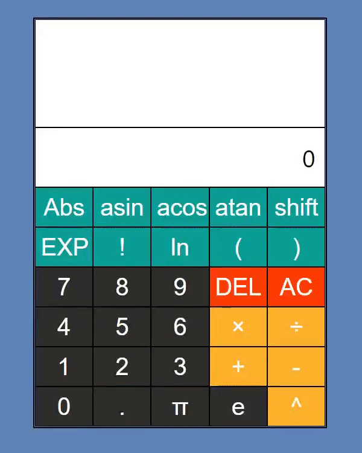

# Calculator App

A calculator that updates expressions dynamically

# Features

<!--  -->

## Basic (Black, Orange, Red)
- Numbers
- Decimal
- Addition, Subtraction, Multiplication, Division, Exponents
- DEL: deletes one character
- AC: All clear, deletes entire expression

## Advanced (Blue)
- Abs: Absolute value, Abs(x) returns the non negative value of x
- Trigonometry functions as well as their inverses
- shift: Inverts the current trigonometry buttons
- EXP: xEy, returns x multiplied by 10 to the power y
- Factorial (!) and natural log (ln)
- Brackets

## Other Features
- The calculator dynamically evaluates the expression
- Can click and manually input expressions into the input window

# Demo

<!--  -->

## Authors

- Me 